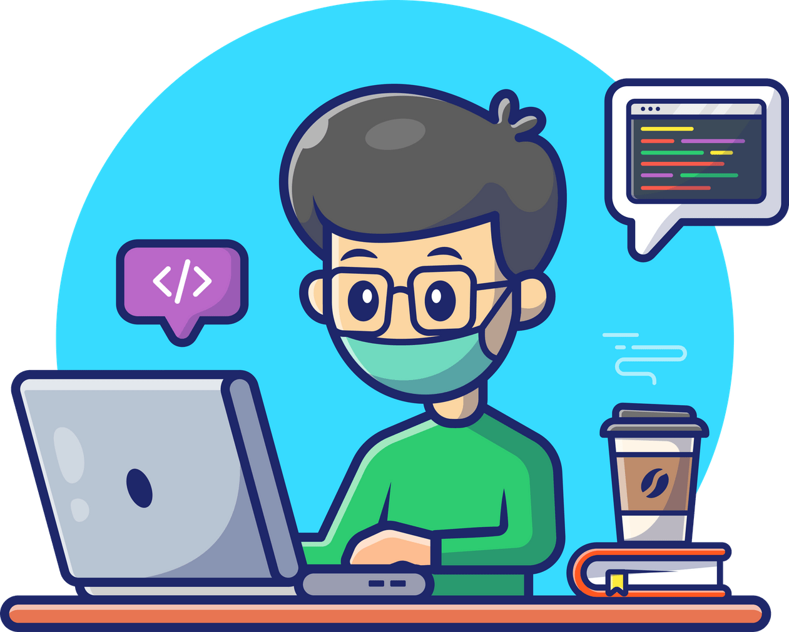

  

<h1 align="center">Joseph Chow</h1>

  <strong>Full-stack engineer</strong> · MCP observability &amp; agent DX 
  <a href="https://josephchow.dev">josephchow.dev</a>

  
  &nbsp;
  
  &nbsp;
  
  &nbsp;
  

## About

I build inspectability for agent tool use — traces, latency, and cost — for MCP clients like Cursor and Claude Code. Local-first by default. I care more about making tool calls debuggable than shipping another chatbot.

Full-stack engineer with 8 years of experience. Currently building AP automation at [Iteration Matrix](https://iterationmatrix.com/); on the side I work on MCP observability and agent DX. Author of **[toolcall-timeline](https://github.com/chowjiaming/toolcall-timeline)**. More at [josephchow.dev](https://josephchow.dev) · **contact@josephchow.dev**

## Work

  

  <em>A Network-tab-style proxy for MCP tool calls — wrap any stdio server, record every call, inspect locally.</em> 
  Works with Cursor · Claude Code · any stdio MCP server

